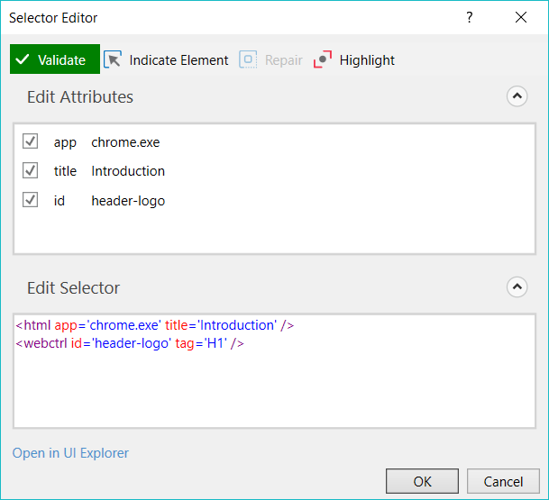

# Summary

- [**Introduction**](#introduction)
    - [Introduction to UiPath – RECAP](#introduction-to-uipath-recap)
      
- [**Variables**](#variables)
    - [Creating Variables](#creating-variables)
    - [Types of Variables](#types-of-variables)
      
- [**Arguments**](#arguments)
    - [Creating Arguments](#creating-arguments)
    - [Using Arguments](#using-arguments)
    - [Naming Conventions](#naming-conventions)
    - [Variables and Data Types - RECAP](#variables-and-data-types-recap)
    - [Data Manipulation - RECAP](#data-manipulation-recap)
      
- [**Recording**](#recording)
    - [Recording Types](#recording-types)
    - [Recording - RECAP](#recording-recap)
      
- [**UI Elements**](#ui-elements)
    - [Input Methods](#input-methods)
    - [Output or Screen Scraping Methods](#output-or-screen-scraping-methods)
    - [Advanced UI Interaction - RECAP](#advanced-ui-interaction-recap)
      
- [**Selectors**](#selectors)
    - [Selectors with Wildcards](#selectors-with-wildcards)
    - [Full versus Partial Selectors](#full-versus-partial-selectors)
    - [UI Explorer](#ui-explorer)
    - [Selectors - RECAP](#selectors-recap)
      
- [**Image and Text Automation**](#image-and-text-automation)
    - [Image and Text Automation - RECAP](#image-and-text-automation-recap)
      
- [**Citrix Automation**](#citrix-automation)
    - [Citrix Specific Automation Techniques and Tools](#citrix-specific-automation-techniques-and-tools)
    - [Advanced Citrix Automation - RECAP](#advanced-citrix-automation-recap)
      
- [**Excel and DataTables Automation**](#excel-and-data-tables-automation)
    - [Excel and Data Tables - RECAP](#excel-and-data-tables-recap)
      
- [**PDF Automation**](#pdf-automation)
    - [PDF Automation - RECAP](#pdf-automation-recap)
      
- [**Email Automation**](#email-automation)
    - [Email Automation - RECAP](#email-automation-recap)
      
- [**Logging**](#logging)
    - [Log Message Types](#log-message-types)
    - [Log Fields](#log-fields)
    - [Debugging and Exception Handling - RECAP](#debugging-and-exception-handling-recap)
      
- [**Project Organization**](#project-organization)
    - [Project Organization - RECAP](#project-organization-recap)

---

# Introduction 

##### (For more information about Introduction, check the complete documentation [here](https://studio.uipath.com/v2018.3/docs/introduction))

UiPath Studio is a complete solution for application integration, and automating third-party applications, administrative IT tasks and business IT processes. One of the most important notions in Studio is the automation project.

A project is a graphical representation of a business process. It enables you to automate rule-based processes, by giving you full control of the execution order and the relationship between a custom set of steps, also known as activities in UiPath Studio. Each activity consists of a small action, such as clicking a button, reading a file or writing to a log panel.

The main types of supported projects are:

- **Sequences** - suitable to linear processes, enabling you to smoothly go from one activity to another, without cluttering your project.
- **Flowcharts** - suitable to a more complex business logic, enabling you to integrate decisions and connect activities in a more diverse manner, through multiple branching logic operators.
- **State Machines** – suitable for very large projects; they use a finite number of states in their execution which are triggered by a condition (transition) or activity.

## Introduction to UiPath - RECAP 

### Overview

This lesson offers an overview of some of the tools you will use when automating – **UiPath Studio**, **UiPath Robot** and **UiPath Orchestrator**. You have been familiarized with the UI of these tools and the role and capabilities of the **Orchestrator**.

Automating processes is easy using UiPath because:

- UiPath has an embedded web scraping mechanism that understands the page structure and can automatically identify lists or tables inside a webpage.
- Recorder functionality in UiPath is helpful to record the actions you want the robot to perform.
- Create reusable component that can be shared by multiple projects.
- There are over 400 activities in uipath studio already created for your convenience and periodically enhanced with more.
- Orchestrator can be used for process and robots management.

### Useful links

- [Introduction](https://studio.uipath.com/v2018.3/docs)
- [About Licensing](https://studio.uipath.com/docs/about-licensing)
- [The User Interface](https://studio.uipath.com/v2018.3/docs/the-user-interface)
- [Keyboard Shortcuts](https://studio.uipath.com/v2018.3/docs/keyboard-shortcuts)
- [About Updating](https://studio.uipath.com/v2018.3/docs/about-updating)
- [Introduction to Automation Debugging](https://studio.uipath.com/v2018.3/docs/about-debugging)
- [Managing Activities Packages](https://studio.uipath.com/v2018.3/docs/managing-activities-packages)
- [Reusing Automations Library](https://www.uipath.com/kb-articles/reusing-automations-library)
- [Installing the Chrome Extension](https://studio.uipath.com/v2018.3/docs/installing-the-chrome-extension)
- [Installing the Firefox Extension](https://studio.uipath.com/v2018.3/docs/installing-the-firefox-extension)
- [Connecting your Project to a Source Control System](https://studio.uipath.com/v2018.3/docs/connecting-your-project-to-a-source-control)
- [Activities Guide](https://activities.uipath.com/)

---

# Variables 

##### (For more information about Variables, check the complete documentation [here](https://studio.uipath.com/v2018.3/docs/managing-variables))

The data stored within a variable is called a value, and it can be of multiple types. In UiPath, we support a large amount of types, ranging from generic value, text, number, data table, time and date, UiElements to any .Net variable type.

## Creating Variables 

Variables should be upper **CamelCase**, such as `FirstName`, `LastName`.

### From the context menu or with a keyboard shortcut (Ctrl+K):

1. In the Properties panel of any activity, right-click a field that can be edited, and select Create Variable from the context menu, or press Ctrl+K. A Set Name field is displayed.
2. Fill in the name and press Enter. The variable is created and you can view and edit it in the Variables panel. The scope of variables created like this always belongs to the smallest container it is part of.

### From the Variables panel:

1. In the Designer panel, click Variables. The Variables panel is displayed.
2. Click the Create Variable line. A new variable with the default values is displayed.

### Browsing for .Net Variable Types:

To search for types of variables that are not displayed by default in the Variable Type list, do the following:

1. In the Variable panel, from the Variable Type drop-down list, select Browse for Types. The Browse and Select a .Net Type window is displayed.
2. In the Type Name field, type a keyword for the variable you are looking for, such as excel. Note that the result section is updated, displaying all the .Net variable types that contain your keyword.
3. Select one and click OK. A new variable is created with the selected type and is displayed in the Variables panel.

---

## Types of Variables 

### Text (String)

A text or string variable is a type of variable that can store only strings. These types of variables can be used to store any information such as employee names, usernames or any other string

### True or False (Boolean)

The true or false variable, also known as boolean, is a type of variable that only has two possible values, true or false. These variables enable you to make decisions, and thus have a better control over your flow.

### Number (Integer or Int32)

Number variables are also known as integer or Int32, and are used to store numeric information. They can be used to perform equations or comparisons, pass important data and many others.

### Array

The array variable is a type of variable which enables you to store multiple values of the same type.

UiPath Studio supports as many types of arrays as it does types of variables. This means that you can create an array of numbers, one of strings, one of boolean values and so on.

### Date and Time

The date and time variable is a type of variable that enables you to store information about any date and time. This type of variable can be found in the **Browse and Select a .Net Type** window, under the System namespace (System.DateTime). For more information, see [Browsing for .Net Variable Types](https://studio.uipath.com/v2018.3/docs/managing-variables#section-browsing-for-net-variable-types).

For example, they can be used to append dates to invoices or any other documents you may be working with and are time-sensitive.

### Data Table

DataTable variables represent a type of variable that can store big pieces of information, and act as a database or a simple spreadsheet with rows and columns. They can be found in the **Browse and Select a .Net Type** window, under the System.Data namespace (System.Data.DataTable). For more information, see [Browsing for .Net Variable Types](https://studio.uipath.com/v2018.3/docs/managing-variables#section-browsing-for-net-variable-types).

These variables can be useful to migrate specific data from a database to another, extract information from a website and store it locally in a spreadsheet and many others.

### GenericValue

The GenericValue variable is a type of variable that can store any kind of data, including text, numbers, dates, and arrays, and is particular to UiPath Studio.

GenericValue variables are automatically converted to other types, in order to perform certain actions. However, it is important to use these types of variables carefully, as their conversion may not always be the correct one for your project.

UiPath Studio has an automatic conversion mechanism of GenericValue variables, which you can guide towards the desired outcome by carefully defining their expressions. Take into account that the first element in your expression is used as a guideline for what operation Studio performs. For example, when you try to add two GenericValue variables, if the first one in the expression is defined as a String, the result is the concatenation of the two. If it is defined as an Integer, the result is their sum.

### Supported .NET Methods

- CompareTo
- Contains
- Equals
- GetHashCode
- GetType
- GetTypeCode
- IndexOf
- Length
- Replace
- Split
- Substring
- ToBoolean
- ToByte
- ToChar
- ToDecimal
- ToDouble
- ToInt
- ToInt16
- ToInt32
- ToInt64
- ToLower
- ToLowerInvariant
- ToSByte
- ToSingle
- ToString
- ToType
- ToUInt16
- ToUInt32
- ToUInt64
- ToUpper
- ToUpperInvariant
- Trim
- TrimEnd
- TrimStart

---

# Arguments 

##### (For more information about Arguments, check the complete documentation [here](https://studio.uipath.com/v2018.3/docs/managing-arguments))

Arguments are used to pass data from a project to another. In a global sense, they resemble variables, as they store data dynamically and pass it on. Variables pass data between activities, while arguments pass data between automations. As a result, they enable you to reuse automations time and again.

UiPath Studio supports a large number of argument types, which coincide with the types of variables. Therefore, you can create Generic Value, String, Boolean, Object, Array, or DataTable arguments and you can also browse for .Net types, just as you do in the case of variables.

Additionally, arguments have specific directions (In, Out, In/Out, Property) that tell the application where the information stored in them is supposed to go.

## Creating Arguments 

Arguments should be in upper **CamelCase** with a **prefix** stating the argument type, such as `in_DefaultTimeout`, `in_FileName`, `out_TextResult`, `io_RetryNumber`.

### From the Arguments panel

1. In the Designer panel, click Arguments. The Arguments panel is displayed.
2. Click the Create Argument line. A new argument with the default values is displayed.

## Using Arguments 

Due to the nature of arguments, you are going to use them a lot in relation with the **Invoke Workflow File** and **Launch Workflow Interactive** activities. They can be found in the **Activities** panel, under **Workflow > Invoke** and they enable you to browse for a project, and import and edit their arguments.

---

## Naming Conventions 

Firstly, projects should have meaningful descriptions, as they are also displayed in the Orchestrator user interface and might help in multi-user environments.

Only argument names are case sensitive, but to improve readability, variables should also align to a naming convention:

- Activity names should concisely reflect the action taken, such as Click the **Save** Button. Keep the part of the title that describes the action (**Click**, **Type Into**, **Element Exists**, etc.).
- Except for Main, all workflow names should contain the verb describing what the workflow does, such as *GetTransactionData*, *ProcessTransation*, *TakeScreenshot*.

## Variables and Data Types - RECAP 

### Overview

This lesson introduced you to the overall **UiPath Studio** interface and the way to add **Activities** to your project.
You learnt about manipulating **variables** and how **Sequence** and **Flowchart** work.

### Takeaways

- **UiPath Studio** has 3 main areas – **Activities panel**, **Workflow designer** and **Properties panel**.
- There are 2 ways of organizing the performed actions – **Sequence** for short and simple workflows, and **Flowchart** for more complex workflows and high level organisation.
- Make sure you use explicit names for your Activities.
- Main types of **variables** are: **integer**, **string**, **datetime**, **boolean**, **generic**, **array of** …
- **Generic variables** can hold any type of data.
- **Renaming** a variable in the variables pane propagates the changes throughout your project.
- Any variable has a **scope** which defines its lifetime.
- You used these activities: **MessageBox** and **Assign**.

### Best practices

- It’s very important to use relevant names for your **Activities**.
- **Sequences** are better suited for simple and small scenarios where the **Activities** follow each other. They are the preferred layout for most workflows.
- **Flowcharts** are best when you need to showcase decision points within a process and they offer higher flexibility regarding the connections between **Activities**.

### Useful links

- [Managing Variables](https://studio.uipath.com/v2018.3/docs/managing-variables)
- [Types of Variables](https://studio.uipath.com/v2018.3/docs/types-of-variables)
- [Managing Arguments](https://studio.uipath.com/v2018.3/docs/managing-arguments)
- [About Imported Namespaces](https://studio.uipath.com/v2018.3/docs/about-imported-namespaces)

## Data Manipulation - RECAP 

### Overview

You have learnt how to modify the data you are working with using techniques like string manipulation or DataTable operations.

### Takeaways

- Activities have properties with **predefined types** that you can check with a mouse hover. You don’t necessarily have to know them, you can use **Ctrl + K** to automatically create a variable of the required type.
- Most of the variables can be split in these categories: **scalar**, **collections** and **tables**.
- You can use **Generic Value** type to store any kind of data, and in many cases you are able to manipulate them using String methods. Other times, you may need to **cast** them to a more specific data type, using methods like **ToString** and **ToInt**.
- **.Arrays** and **lists** are very similar, the main difference being that lists have a variable size, while an array has a fixed size.
- When looking to store **key/value pairs** or just have a single variable for multiple values you should use **Dictionaries**.
- By typing “dot” after a String variable, Intellisense shows you a list of available methods of the **String data type**.
- Use String’s **Split** method you can get the pieces of a string separated by a given set of characters.
- Strings can be concatenated by using the “+” sign, but for more complex cases you should use the String **Format** method.

### Best practices

- All data types have a default **ToString** method.
- Visual Basic provides **Now**, a DateTime with the current timestamp.
- When using **Read CSV** make sure you check the property **IncludeColumnNamesif** you want the first row to be treated as column names.
- You can filter table rows by using the **Select** method.

---

# Recording 

##### (For more information about Recording, check the complete documentation [here](https://studio.uipath.com/v2018.3/docs/about-recording))

Recording is an important part of UiPath Studio, that can help you save a lot of time when automating your business processes. This functionality enables you to easily capture a user’s actions on the screen and translates them into sequences.

These projects can be modified and parameterized so that you can easily replay and reuse them in as many other processes as you need.

All user interface elements are highlighted while you record, as you can see in the following screenshot, so that you can be sure the correct buttons, fields or menus are selected.

Interactions with UI elements yield informative screenshots in the automation. These can be changed, hidden, removed or shown in full size by selecting the respective action from the **Options** menu.

All screenshots are automatically saved as `.png` files in the same location as your project, in a separate folder named ".screenshot" By default, the path is: `C:\Users\your_user_name\Documents\UiPath\your_project_name\.screenshots`.

Regardless of the type of recording selected, some actions are recordable and some are not.

**Recordable:**
- Left-click on buttons, check boxes, drop-down lists and other GUI elements
- Text typing

**Non-Recordable**
- Keyboard shortcuts
- Modifier keys
- Right-click
- Mouse hover

## Recording Types 

There are four types of recordings available in UiPath Studio:

- **Basic** – generates a full selector for each activity and no container, the resulted automation is slower than one that uses containers and is suitable for single activities.
- **Desktop** – suitable for all types of desktop apps and multiple actions; it is faster than the **Basic** recorder, and generates a container (with the selector of the top-level window) in which activities are enclosed, and partial selectors for each activity.
- **Web** – designed for recording in web apps and browsers, generates containers and uses the **Simulate Type/Click** input method by default.
- **Citrix** – used to record virtualized environments (VNC, virtual machines, Citrix, etc.) or SAP, permits only image, text and keyboard automation, and requires explicit positioning.

To see all the available types of recordings and select the one most suited for your project, click **Recording**, in the **Wizards** group of the **Design** ribbon tab.

All recording types come with their own controllers (or toolbars) that give you access to actions particular to each environment, but also some common ones.

The **Desktop**, **Basic** and **Web Recording** toolbars are quite similar and enable you to:

- Automatically record multiple actions performed on the screen
- Manually record single actions, such as:
    - Starting or closing an application or web browser
    - Clicking an interface element
    - Selecting an option from a drop-down list
    - Selecting a check box
    - Simulating keystrokes or keyboard shortcuts
    - Copying text from a UI element or performing screen scraping
    - Looking for elements or waiting for them to vanish
    - Finding an image
    - Activating a window
    
    

- The **Citrix Recording** toolbar enables you to:
    - Click an image or text
    - Simulate keystrokes or hotkeys
    - Select and copy text from a window
    - Scrape UI elements
    - Look for elements or wait for them to vanish
    - Find an image or wait for it to vanish
    - Activate a window

To figure out if you should use automatic or manual recording in your project, you should better understand the differences between the recording types and their capabilities.

- Automatic Recorder
    - Left-click on windows, buttons, check boxes, drop-down lists etc.
    - Text typing

- Manual Recorder
    - Keyboard shortcuts
    - Modifier keys
    - Right-click
    - Mouse hover
    - Getting text
    - Find elements and images
    - Copy to Clipboard

Keyboard shortcuts that you can use while recording:
- F2 – pauses for 3 seconds. A countdown timer is displayed in the bottom left corner of the screen. Can be useful with menus that automatically hide.
- Esc – exits the automatic or manual recording. If you press the Escape key again, the recording is saved as a sequence, and you return to the main view.
- Right-click – exit the recording.

## Recording - RECAP 

### Overview

This chapter familiarized you with the wizards used for creating a workflow skeleton for your UI automation purposes. You should now know which recorder to use – Basic, Desktop, Web or Citrix – and what is the appropriate recording method – step by step or automatic.

### Takeaways

- There are 4 types of recording: **Basic**, **Desktop**, **Web** and **Citrix**.
- You can record by clicking the appropriate button in UiPath Studio and stop or save the recording by hitting the **“Escape”** key.
- The images associated with an action are purely informative and do not affect the workflow in any way.
- Use the **Empty Field** property of the **Type Into** activity if you need to clear the existing text before writing.
- Some things are getting recorded, some are not:
    - Recorded: left clicks on buttons, checkboxes and other clickable elements, typing into editable fields;
    - Not recorded: keyboard shortcuts, modifier keys, right clicks, mouse hover.
- When attempting to record actions that involve elements that automatically hide use **“F2”** to temporarily **pause** the recording for 3 seconds.
- Some steps cannot be automatically added when recording – pause the recording and manually add them from the recording controller.
- Similar to **Desktop** recording, **Web** recording generates all of its actions inside an **Attach Browser** container.
- When using expressions with variables of the type Generic Value make sure you start with an element that is of your desired type.

### Best practices

- UI automation works best when the Robot and the applications that it controls are on the same machine, thus allowing direct integration with the technologies behind those applications.

### Useful links

- [About Recording](https://studio.uipath.com/v2018.3/docs/about-recording)

---

# UI Elements 

##### (For more information about UI Elements, check the complete documentation [here](https://studio.uipath.com/v2018.3/docs/about-ui-elements))

UI elements refer to all graphical user interface pieces that construct an application, be they windows, check boxes, text fields or drop-down lists, and so on. Knowing how to interact with them enables you to implement UI automation much faster and easier.

It is possible to create automations with UI elements from most applications, including Universal Windows Platform apps.

All interactions with the UI can be split into input and output. This categorization helps you better understand which actions to use in different scenarios, when to use them, and the technology behind them. These are also going to be useful when dealing with scraping.

1. **Input Actions**
    - Clicks
    - Text typing
    - Keyboard shortcuts
    - Right-clicks
    - Mouse hover
    - Clipboard actions
    - Etc.

2. **Output Actions**
    - Getting text
    - Finding elements and images
    - Clipboard actions
    - Etc.

## Input Methods 

Input actions require you or the robot to directly interact with an opened application or web page. There are three types of input methods for click and type actions, that differ in terms of compatibility and capability.

We generally recommend the **Simulate Type/Click** method as it is the fastest of the three and works in the background, but only if you do not need to send special keyboard shortcuts. If this does not work for you, try the **SendWindowMessages** method and then the **Default** one, as it is the slowest.

The input method can be changed at any point from the **Properties** panel of the selected activity. If the **SimulateType** or **SendWindowMessages** check boxes are not selected, then the **Default** method is applied.

The **Default** application simulates a click or type with the help of the hardware driver, while the **Simulate Type/Click** method uses the technology of the target application. Lastly, the **SendWindowMessages** works by sending a specific message directly to the target application.

## Output or Screen Scraping Methods 

Output or screen scraping methods refer to those activities that enable you to extract data from a specified UI element or document, such as a .pdf file.

**FullText** is the default method, it is fast and accurate, yet unlike the **Native** method, it cannot extract the screen coordinates of the text.

Both these methods work only with desktop applications, but the **Native** method only works with apps that are built to render text with the Graphics Device Interface (GDI).

**OCR** is not 100% accurate, but can be useful to extract text that the other two methods could not, as it works with all applications including Citrix. Studio uses two OCR engines, by default: Google Tesseract and Microsoft Modi.

Languages can be changed for OCR engines and you can find out how to [Install OCR Languages here](https://studio.uipath.com/docs/installing-ocr-languages).

To start extracting text from various sources, click the **Screen Scraping** button, in the **Wizards** group, on the **Design** ribbon tab.

The screen scraping wizard enables you to point at a UI element and extract text from it, using one of the three output methods described above. Studio automatically choses a screen scraping method for you, and displays it at the top of the **Screen Scraper Wizard** window.

To change the method of screen scraping, select another one from the **Options** panel and then click **Refresh**.

When you are satisfied with the scraping results, click **Finish**. The latter option copies the extracted text to the Clipboard, and it can be added to a **Generate Data Table** activity in the **Designer** panel. Just like desktop recording, screen scraping generates a container (with the selector of the top level window) which contains activities, and partial selectors for each activity.

Each type of screen scraping comes with different features in the **Screen Scraper Wizard**, in the **Options** panel:

1. **FullText**

    

    - Ignore Hidden – when this check box is selected, the hidden text from the selected UI element is not copied.

2. **Native**

    
    
    - **No Formatting** – when this check box is selected, the copied text does not extract formatting information from the text. Otherwise, the extracted text’s relative position is retained.
    - **Get Words Info** – when this check box is selected, Studio also extracts the screen coordinates of each word. Additionally, the **Custom Separators** field is displayed, that enables you to specify the characters used as separators. If the field is empty, all known text separators are used.

3. **Google OCR**

    
    
    - **anguages** – only English is available by default.
    - **Characters** – enables you to select which types of characters to be extracted. The following options are available: **Any character**, **Numbers only**, **Letters**, **Uppercase**, **Lowercase**, **Phone numbers**, **Currency**, **Date** and **Custom**. If you select Custom, two additional fields, Allowed and Denied, are displayed that enable you to create custom rules on which types of characters to scrape and which to avoid.
    - **Invert** – when this check box is selected, the colors of the UI element are inverted before scraping. This is useful when the background is darker than the text color.
    - **Scale** – the scaling factor of the selected UI element or image. The higher the number is, the more you enlarge the image. This can provide a better OCR read and it is recommended with small images.
    - **Get Words Info** – gets the on-screen position of each scraped word.

4. **Microsoft OCR**

    
    
    - **Languages** – enables you to change the language of the scraped text. By default, English is selected.
    - **Scale** – the scaling factor of the selected UI element or image. The higher the number is, the more you enlarge the image. This can provide a better OCR read and it is recommended with small images.
    - **Get Words Info** - gets the on-screen position of each scraped word.
    
    Besides getting text out of an indicated UI element, you can also extract the value of multiple types of attributes, its exact screen position, and its ancestor.
    
    This type of information can be extracted through dedicated activities that are found in the **Activities** panel, under **UI Automation > Element > Find** and **UI Automation > Element > Attribute**.
        
    These activities are:
        
        - [**Get Ancestor**](https://activities.uipath.com/docs/get-ancestor) – enables you to retrieve an ancestor from a specified UI element. You can indicate at which level of the UI hierarchy to find the ancestor, and store the results in a UiElement variable.
        
        
        
        - [**Get Attribute**](https://activities.uipath.com/docs/get-attribute) – retrieves the value of a specified UI element attribute. Once you indicate the UI element on screen, a drop-down list with all available attributes is displayed.
        
        
        
        - [**Get Position**](https://activities.uipath.com/docs/get-position) – retrieves the bounding rectangle of the specified UiElement, and supports only Rectangle variables.
        
        

    UiPath Studio also features **Relative Scraping**, a scraping method that identifies the location of the text to be retrieved relative to an anchor. You can find more about it [here](https://studio.uipath.com/v2018.3/docs/relative-scraping).
    
    You can also generate tables from unstructured data and store the information in DataTable variables, by using the **creen Scraping Wizard**. For more information, see [Generating Tables from Unstructured Data](https://studio.uipath.com/v2018.3/docs/generating-tables-from-unstructured-data).

## Advanced UI Interaction - RECAP 

### Overview

This chapter covered the User Interface interactions and their main corresponding methods, with their pros and cons. You have also been introduced to the Data Scraping Wizard.

### Takeaways

**Input** actions are those that take some direct actions on the entity you are automating, making it do something.
**Output** actions are those that pull information out of the entity you are working with.

**Input** actions are split into 3 methods:

The **Default** method uses the mouse and keyboard drivers to simulate an
actual human operatingthem.

**Output** actions that do **Screen Scraping** are split into 3 methods:

- An advantage of the Native method is that it also gets the text position while maintaining the accuracy of the FullText method.
- OCR uses 2 engines: **Microsoft OCR** is suitable for large images, while **Google’s engine** works better with smaller images and also provides a few more options like **scale** or **invert**.
- **Data Scraping** allows you to extract structured data by pointing the first and second element you want to extract (and, when required, the link to the next page).
- Use **Extract correlated data** when you need more than 1 piece of information from each element and **Max Number Of Results** to limit the amount of items you get.

### Best practices

- Make sure you always choose the right input method that suits your needs.
- The recommended input method is **Simulate** because it’s the fastest.
- The recommended output method is **FullText** because it’s fast and accurate.
- You should only use OCR only as a last resort.

### Useful links

- [About UI Elements](https://studio.uipath.com/v2018.3/docs/about-ui-elements)

---

# Selectors 

##### (For more information about Selectors, check the complete documentation [here](https://studio.uipath.com/v2018.3/docs/about-selectors))

To automate specific actions in the user interface, you are required to interact with various windows, buttons, drop-down lists and many others. Most RPA products do this by relying on the screen position of UI elements, a method that is not at all dependable.

To overcome this problem, UiPath Studio uses what we call selectors. These store the attributes of a graphical user interface element and its parents, in the shape of an XML fragment.

Most of the times, selectors are automatically generated by Studio and do not require further input from you, especially if the apps you are trying to automate have a static user interface.

However, some software programs have changing layouts and attribute nodes with volatile values, such as some web-apps. UiPath Studio cannot predict these changes and, therefore, you might have to manually generate some selectors.

A selector has the following structure:

`<node_1/><node_2/>...<node_N/>`

The last node represents the GUI element that interests you, and all the previous ones represent the parents of that element. <node_1> is usually referred to as a root node, and represents the top window of the app.

Each node has one or more attributes that help you correctly identify a specific level of the selected application.

Each node has the following format:

`<ui_system attr_name_1='attr_value_1' ... attr_name_N='attr_value_N'/>`

Every attribute has an assigned value. It is important to pick attributes with a constant value. If the value of an attribute changes each time the app is started, then the selector will not be able to correctly identify the element.

Selectors are stored in the **Properties** panel of activities, under **Input > Target > Selector**. All activities related to graphical elements have this property.

The **Selector Editor** window enables you to see the automatically-generated selector and edit it and its attributes. To access this window, in the **Workflow Designer** panel, click the Options button in the body of an activity and select **Edit Selector**.

## Selectors with Wildcards 

Wildcards are symbols that enable you to replace zero or multiple characters in a string. These can be quite useful when dealing with dynamically-changing attributes in a selector.

- Asterisk (\*) – replaces zero or more characters
- Question mark (?) – replaces a single character

## Full versus Partial Selectors 

### Full selectors:

- Contain all the elements needed to identify a UI element, including the top-level window
- Generated by the Basic recorder
- Recommended when switching between multiple windows

### Partial selectors:

- Generated by the Desktop recorder
- Do not contain information about the top-level window
- Activities containing partial selectors are enclosed in a container (Attach Browser or Attach Window) that contains a full selector of the top-level window
- Recommended when performing multiple actions in the same window

Example of a partial selector for the editable panel in Notepad:

Example of a full selector for the editable panel in Notepad:

Selector Editor and UI Explorer display the full selector, not just the partial one. However, only elements belonging to the partial selector can be edited, the prepended ones are grayed out and read-only.

## UI Explorer 

**UI Explorer** is an advanced tool that enables you to create a custom selector for a specific UI element. It is available only if the `UiPath.UIAutomation.Activities` package is installed as a dependency to the project.

To open the **UI Explorer** window, click the button in the **Selectors** section, in the **Design** tab.

Alternatively, the **UI Explorer** can be launched from the **Tools** page in the Studio backstage view. UI Explorer from the context menu uses the UI automation libraries shipped with the current version of Studio.

To be sure that you choose the best selector, remember to:

- Add or remove attributes
- Add parent or children tags
- Use wildcards to replace changing values

## Selectors - RECAP 

### Overview

In this chapter we addressed one of the most important parts in UiPath automation: **selectors**.
These xml strings contain properties that uniquely define a specified element.

### Takeaways

- Interfaces are built by using **containers**, nested one inside the other.
- You can think of a **selector** as a path to the required UI element, starting from the root container and all the way to our target.
- A **selector** contains 2 types of information: the element type and one or more of its attributes.
- When automatically building a **selector**, UiPath tries to use only the first and last container but it also adds intermediate ones only needed.
- Selectors should be constructed in such a way that they point to only one element in the environment. If a robot finds multiple possible matches for a selector, it uses the first one it encounters – usually the topmost one When automatically building a selector, UiPath tries to use only the first and last container but it also adds intermediate ones only needed.
- **Basic recording** generates **full selectors** while **Desktop recording** generates only **partial** ones.
- You can build **dynamic selectors** using the 2 available **wildcards**: **question mark (?)** takes the place of a single character and **asterisk (\*)** that replaces any number of characters or by using variables.
- Use **Attach to live element** to update an existing selector to also match a 2nd element.
- Use the selector’s **idx** property to get a certain occurrence of an element that is found multiple times.
- Anchor Base activity and Select Relative Element in UiEplorer can be very useful to build reliable automations when the selectors might not be very stable.

### Best practices

- Avoid using the **idx** attribute if its value is larger than 2, unless you don’t have other options. Always try to add other attributes to make sure the selector is stable.
- When it’s likely that you will have interference from other applications and windows it’s best to use partial selectors.

### Useful links

- [About Selectors](https://studio.uipath.com/v2018.3/docs/about-selectors)
- [UI Explorer](https://studio.uipath.com/v2018.3/docs/uipath-explorer)

---

# Image and Text Automation 

##### (For more information about Image and Text Automation, check the complete documentation [here](https://studio.uipath.com/v2018.3/docs/about-image-and-text-automation))

To enable image and text-based process automation, UiPath Studio features activities that simulate **keyboard and mouse** input, such as clicking, hovering or typing, **text recognition** and **OCR** activities that use screen scraping to identify UI elements, and **image recognition** activities that work directly with images to identify UI elements. Specialized recording wizards for Screen Scraping and Citrix recording can also automatically generate the activities required for each process, as explained [here](https://studio.uipath.com/v2018.3/docs/about-recording).

Image and Text automation is useful in situations when UI automation does not work, such as in virtual machine environments, where selectors cannot be found by using normal methods.

## Image and Text Automation - RECAP 

### Overview

This chapter introduced you to the techniques used to automate virtualized environments, where all interactions are performed using images.
In this context, you also learned how to use **image-based automation** and **Optical Character Recognition** or **OCR**.

### Takeaways

- Since you cannot use selectors on the image that is sent in a Citrix environment, the approach is a little different than in other scenarios: you perform actions in relation to some elements.
- In a Citrix environment, **Click Image** and **Click OCR Text** are your best friends for inputting.
- **Scrape Relative** scrapes only a portion of an image, relative to an anchor
- Both **Click OCR Text** and **Click Image** offer options for modifier keys, single or double click and left or right mouse buttons.
- Remember you can tweak the **Click lmage**’s **Accuracy** property to get the desired results. This value goes from O to 1 and higher values mean higher similarity between the images.
- Getting information out of such environments is done through the use of 2 methods: Copy Selected Text (**Select & Copy** from the recorder) and **Scrape Relative**. Just keep in mind that for **Copy Selected Text** to work you need Clipboard sharing enabled between local and Citrix environment.
- **Click OCR Text** uses **OCR** to find the target text.

### Best practices

- Click Image is fast and reliable, but sensitive to graphical variations, while **Click OCR Text** is immune to such changes but susceptible to OCR failures.
- To avoid the problems that come with **Click OCR Text** and **Click Image** you should use keyboard shortcuts as much as possible.
- Selecting too much or too little of an image might lead to it not being found or a false positive.
- To get good results when matching images, the resolution should be at least equal to the one used when recording the workflows. You can also compensate such losses by lowering the **Accuracy** factor.
- Pay attention to how the application layout changes on different resolutions when using coordinate based techniques.

### Useful links

- [About Image and Text Automation](https://studio.uipath.com/v2018.3/docs/about-image-and-text-automation)

---

# Citrix Automation 

##### (For more information about Citrix Automation, check the complete documentation [here](https://studio.uipath.com/v2018.3/docs/introduction-to-citrix-automation))

The **Citrix Recording Wizard** is one of the most important tools in automating virtual machines, as it facilitates the automation of any action, generating activities which are already configured.

Opening applications must be done according to certain rules, as the **Click** activity is not very reliable in virtualized environments. There are usually other, safer methods through which applications can be opened, as they do not rely on communicating with the virtualized environment by directly clicking the window.

Understanding how **OCR** and **Image** activities work is also essential in automating in virtual machines, as they enable the identification of UI elements and the inputting and retrieving of data from applications.

## Citrix Specific Automation Techniques and Tools 

### Citrix Recording Wizard

The easiest way to automate in virtualized environments is using the specialized **Citrix Recorder**, which automatically generates fully-configured activities based on the user’s actions. It also facilitates the use of techniques such as Relative Scraping. The **Recording Wizard** is designed to simulate human behaviour and is specialized in using activities and technologies specific to virtual environment automation, such as OCR and Image Recognition activities.

Sometimes, the automatically generated selectors propose volatile attribute values to identify elements. This means activities might not work properly in all circumstances, and manual intervention is required to calibrate the selectors. A reliable selector should successfully identify the same element every time in all conditions, regardless of external changes in resolution or UI element position.

### Opening Applications in Citrix

Usually, apps are opened by clicking their shortcut or executable file. The location of these files can normally be identified by several means, such as screen coordinates or selectors.

In virtualized environments, these ways of identifying the shortcut’s location are unavailable, so, for clicking, **Image** and **OCR** activities must be used to identify the location of the shortcut or executable file. Since these activities are based on image and text recognition, slight graphical differences, such as changes in resolution or highlighting the icon, can cause the identification of the shortcut to fail. A solution for this issue is selecting an area of the icon that does not include any portion of the background image, such as the center area of the icon.

A best practice in opening applications in virtual machine environments is creating a **shortcut** for the application on the desktop of the machine, assigning it a **hotkey**, and then sending that hotkey to the remote desktop connection window by using a **Send Hotkey** activity. It is recommended to use a more complex key combination for the shortcut, to avoid interfering with existing ones.

Another safe way to start apps in virtual environments is by using the **Command Prompt**. For example, you can send the path of the application to the **Command Prompt** terminal with the **Send Hotkey** and **Type Into** activities. This method also enables you to input arguments for the app to be opened.

### Waiting for Certain States of Applications

There are situations when waiting for a certain state of an application is essential to creating an optimal automation. In desktop environments, UiPath activities are configured to wait for certain states before acting, as Studio has direct access to the operating system and can understand applications on a logical level.

In virtual environments, Studio does not have access to the underlying elements of the operating system, so other methods must be employed to identify application states.

To make sure an application is fully loaded before interacting with it, you must identify visual elements that show the page or app is done loading, such as specific pictures or buttons. In this regard, you can use the **On Image Appear** and **Find Image** activities to monitor the virtual environment, and allow the project to continue the execution only when a certain UI element appears. A better and more general solution is to wait for the application’s loading icon to disappear, in case it exists. An **On Image Vanish** activity can be used for this purpose, allowing the automation to continue only when the loading icon vanishes.

A bad practice in waiting for an application to load is adding a Delay activity to your project. This method is prone to failure because loading times for software programs can vary due to many factors.

### Identifying UI Elements

Since virtual environments offer no way to identify UI elements via standard means, visual anchors are the only remaining option. UiPath Studio features activities that use OCR or Image Recognition technologies that are meant to be used in such situations.

There are several OCR engines that can be used with UiPath Studio: Google Tesseract, Microsoft MODI and Abbyy. The Google Tesseract engine works better for scraping smaller areas, while Microsoft MODI is more suitable for larger ones.

### Inserting Data in Citrix

As explained earlier, clicking UI elements in virtual environments can be tricky, due to changes in resolution or background colors. Thus, inserting data in Citrix in an optimal fashion implies using methods that are not prone to failure, such as making use of keyboard shortcuts and sending hotkeys to the virtual machine window in order to avoid clicking.

**Relative Click** is a technique that enables you to click UI elements by using other buttons or labels around them as anchors. In situations where selectors cannot be found, the target UI objects are identified by using image recognition activities to look for adjacent visual labels or other such elements.

A good way to insert data from a machine into a virtual environment is using the shared clipboard. This method has the advantage that it can easily paste data into the virtual machine by first clicking the app to be automated and sending it the Ctrl + V hotkey.

To avoid having to identify the UI elements’ location in order to click them, it is recommended to switch between buttons and text fields by using Tab, Enter and the navigation keys. Another very useful activity for typing text in virtual machines is **Type Into**, because it interacts with the application by sending keystrokes, just like a human user would.

If using keyboard commands to navigate through UI elements is not an option, then Image and Text recognition is the alternative to automating in virtual environments. Image recognition has its own weaknesses, being sensitive to environment variations like changes in desktop theme or screen resolution. When the application runs in Citrix, the resolution should be kept greater or equal than when recording the automations. Otherwise, small image distortions can be compensated by slightly lowering the **Accuracy** property of the image activities. Check how the application layout adjusts itself to different resolutions to ensure visual elements’ proximity, especially in the case of coordinate based techniques like **Relative Clicking** and **Relative Scraping**. To enable the automation to support different resolutions, parallel recordings can be placed inside a **Pick Branch** activity and the suitable one can be automatically chosen for the optimal resolution.

### Retrieving Data from Citrix

Retrieving data from a virtual environment has its own limitations, as the Native and FullText scraping methods that retrieve text directly from the operating system do not work in virtual environments. Thus, OCR-based activities are essential in scraping the screen of the Citrix machine.

Just like in the case of data input, the shared clipboard is a useful and reliable tool in retrieving text from Citrix, as it can be easily accessed by sending the Ctrl + C hotkey to the window via the **Send Hotkey** activity.

The **Copy Selected Text** activity is another activity that can copy text from the virtual machine environment, that has a very similar behaviour to using the shared clipboard.

Additionally, relative scraping is a useful technique that enables you to retrieve text from UI elements by using OCR technology, relative to anchors in the window, such as text box labels or buttons.

## Advanced Citrix Automation - RECAP 

### Overview

In this chapter we talked about the challenges that come with automating **Citrix** environments.
We looked at **Find Image** Activity, because it’s important to know when to perform certain actions, and we also tackled the challenge of starting an application in such environments.

### Takeaways

- Use **Find Image** to wait for a page or an application to finish loading.
- It’s easier to automate such environments by using **keyboard shortcuts**.
- If you want to start an application by double clicking its desktop icon pay attention to the image selection, since it will be vulnerable to background color changes or even state changes such as when the icon is selected.
- A better way of starting an application is by assigning it a **keyboard shortcut**.
- If you want to run an application with parameters you can use **Win + R** and put in the full path of the application and add the parameters after it.

### Best practices

- Always use **keyboard shortcuts** when possible since it’s faster and more reliable.
- When waiting for an application to load, don’t add a delay to your actions, you should instead use **Find Image** or other similar techniques.
- When using **command prompt** to run an application, you can either try to use the **Win + R** combination or, if this doesn’t work even in fullscreen mode, try opening Start menu and typing “cmd”.

### Useful links

- [About Citrix Automation](https://www.uipath.com/developers/video-tutorials/advanced-citrix)

---

# Excel and DataTables Automation 

Workbooks are references to Excel files, regardless of the data, format and layout they contain. 

Data tables are the simplest types of spreadsheet data with rows and columns, with or without headers. 

**Excel Application Scope** is a container that enables you to work with all the other Excel activities. This activity is where you specify the .xlsx file you want to work with.

Additionally, you can work with this container even if you do not have MS Office Excel installed on the machine, if the Visible property is cleared.

## Excel and Data Tables - RECAP 

### Overview

**Excel** and **DataTable** specific activities have been presented in this lesson, together with the way to work with defined ranges and tables.

### Takeaways

- When working with Excel files you should work inside the container generated by **Excel Application Scope**, or, better yet, when possible you should use **Workbook** activities because they don’t require Excel to be installed and they can work completely in the background.
- The **Visible** property determines if the operations will be performed with the Excel file opened in the **foreground** or if they will be executed in the background.
- When using the Direct Access method the operations will be done **internally**, while the Excel Application Scope will perform them by using Microsoft Excel.
- **Read Range** activity reads a part of an Excel file and stores it in a **DataTable**.
- A **Workbook** is just a reference to an Excel file that can hold many types of data, while a **DataTable** is just a table with rows and columns.
- **Write Range** will overwrite previous entries, while **Append Range** will not, adding the data after the current content instead.
- Both **Read Range** and **Write Range** have the **Add Headers** property that indicates the presence of a first row that contains the column names.
- There are **CSV** activities that are very similar to the Excel ones.
- When creating a **DataTable** with the **Build Data Table** activity, the available data types for a column are spanning all the range of Visual Basic .NET.
- The **Sort Table** and **Filter Table** activities require a table to be defined in Excel.
- An useful tool when working with Excel files is the **Select Range** activity.
- There is a **For Each** correspondent when working with DataTables – **For Each Row**.
- Instead of using an index, if you have headers you can also use column names with the **Get Row Item** activity.

### Useful links

- [Data Table Variables](https://www.uipath.com/developers/guides-and-resources)
- [Excel and Data Tables Automation](https://www.uipath.com/developers/video-tutorials/excel-and-datatables-automation)

---

# PDF Automation 

## PDF Automation - RECAP 

### Overview

In this lesson you have learnt about the types of PDF documents and the available methods for extracting data from such files. We also looked into anchors, a way to deal with unstable selectors.

### Takeaways

- You can place PDF activities into 2 categories: one for when processing large chunks of text or whole documents and one for when focusing on specific text elements.
- When looking to extract data from PDF, depending on your file you should choose one of these 2 activities: **Read PDF Text** and **Read PDF With OCR**.
- Both activities can run in the background.
- Another method of grabbing blocks of text is the **Screen Scraping** tool.
- When looking to extract a certain value from PDF files, you can also use **Anchor Base**.

### Best practices

- Use **Read PDF Text** instead of **Read PDF With OCR** when possible since OCR is error prone.
- The **Anchor Base** method can be more reliable than the others since it can handle major structural changes in the file.

### Useful links

- [PDF Data Extraction](https://www.uipath.com/kb-articles/pdf-data-extraction-scrape-pdf-text)

---

# Email Automation 

## Email Automation - RECAP 

### Overview

This lesson got into a very important subject: emails. There are many processes that involve emails, which usually are a trigger or an ending for such a process. You learnt about sending and receiving emails, working with attachments and even message templates.

### Takeaways

- There are many email activities depending on the protocol you want to use: **SMTP**, **POP3**, **IMAP**, **Exchange** and **Outlook**.
- The get email activities offer mainly the same functionalities:
    - Fetching email from a certain mailbox folder (Outlook, IMAP and Exchange)
    - Fetching only unread messages and marking them as read (Outlook, IMAP and Exchange)
    - Setting a limit for the number of incoming emails
- The **MailMessage** object doesn’t directly provide timestamp information, so you will need to access the “Date” value from the **Headers dictionary**.
- The Outlook activity provides a feature for filtering the incoming messages based on criteria like **Subject** or **ReceivedTime**.
- When loading a template for an email from a file you can use string formatting to populate placeholders with dynamic data.

### Best practices

- **Outlook** and **Exchange** activities are easier to use since they don’t require connection parameters.
- If **Outlook** is configured, it’s usually your best choice since it requires the least amount of setting up while offering extra features and being compatible with any email protocol.

---

# Logging 

##### (For more information about Logging, check the complete documentation [here](https://studio.uipath.com/v2018.3/docs/studio-logs))

## Log Message Types 

There are several possible occurrences of log messages, depending on the event that is logged, as follows:

### Default Logs

Generated by default when the execution of a project starts and ends, when a system error occurs and the execution stops, or when the logging settings are configured to log the execution of every activity.

The events logged by this category are:

- **Execution Start** is generated every time a process is started. This is logged starting with the **Information** logging level.
- **Execution End** is generated every time a process is finalized. This is logged starting with the **Information** logging level.
- **Transaction Start** is generated every time a transaction within a process is started. This is logged starting with the **Information** logging level.
- **Transaction End** is generated every time a transaction within a process is finalized. This is logged starting with the **Information** logging level.
- **Error Log** is generated every time the execution encounters an error and stops. This is logged starting with the **Error** logging level.
- **Debugging Log** is generated if the Robot Logging Setting is set to Verbose and contains, activity names, types, variable values, arguments etc. This is logged starting with the **Trace** logging level.

### User-Defined Logs

Generated according to the process designed by the user in Studio, when using the **Log Message** activity or the **Write Line** activity.

## Log Fields 

There are multiple types of log fields that can be found throughout the above log message types. These can be classified as follows:

### Default fields

These log fields are present in all execution type logs, such as SQL (if configured), Elasticsearch (if configured), and the default EventViewer Logs:

- `Message` - The log message.
- `Level` - Defines the log severity.
- `Timestamp` - The exact date and time the action was performed.
- `FileName` - The name of the `xaml` file being executed.
- `jobId` - The key of the job running the process.
- `processName` - The name of the process that triggered the logging.
- `processVersion` - The version number of the process.
- `windowsIdentity` - The name of the user that performed the action that was logged.
- `robotName` - The name of the robot (as defined in Orchestrator).

### Type-specific fields

These logs are present depending on the log type:

#### Execution End

- `totalExecutionTimeInSeconds`
- `totalExecutionTime`

#### Transaction Start

- `queueName`
- `transactionID`
- `transactionState`

#### Transaction End

- `queueName`
- `transactionID`
- `transactionState`
- `transactionStatus`
- `transactionExecutionTime`
- `processingExceptionType`
- `processingExceptionReason`
- `queueItemReviewStatus`
- `queueItemPriority`

#### Debugging Log

- `activityInfo`, which is a JSON message with the following fields:
    - `DisplayName`
    - `State` (Faulted, Closed, Executing)
    - `Activity`
    - `Variables`
    - `Arguments`

### User-defined fields

These fields are defined in Studio by using the **Add Log Fields** activity and appear in all subsequent logs after the activity is generated, unless they are removed by the **Remove Log Fields** activity.

## Debugging and Exception Handling - RECAP 

### Overview

In this module we dived into 2 of the most important aspects of software development in general and the tools UiPath Studio offers in these regards. You were introduced to the **Debug tab** and the **Try Catch Activity**, along with some other useful techniques.

### Takeaways

- You can start debugging by pressing the **Start Debug button** from the **Execute tab**.
- When debugging, you can notice 3 things that happen:
    - There is a yellow highlight for the action that is currently executed, and, if suitable, an optional red highlight for the element that is affected by this action.
    - The **Locals panel**, where you can check the current value of all the variables.
    - A detailed log of all the actions that took place in the workflow.
- If you need to slow things down, use the **Slow Step button**, or you can completely pause the execution by using the **Toggle Breakpoint button** and continue the execution step by step by using the **Step Over button**.
- When waiting for an application to load, an activity’s default timeout value is 30 seconds, but you can also use activities like **Element Exists**, **Find Element** or **Wait Element Vanish** and their image counterparts.
- **Element Exists** doesn’t affect your workflow, it just returns a boolean value, whereas the other 2 activities will stop execution until an element is found or it disappeared.
- The **Try Catch** activity should contain the actions that might throw an error inside the **Try** block, the actions to take when an error occurs inside the **Catch** block and, optionally, the actions to always be performed after the other 2 blocks inside the **Finally** block.
- You can have multiple **Catches** for different types of exceptions.
- Even though you caught an exception, you sometimes might want to make sure the workflow actually stops, in that case you can use the **Rethrow** activity.
- You can separate individual components of your automation into different workflow files and then call them using **Invoke Workflow**.

### Best practices

- It’s very important to use relevant names for actions and flowcharts, and it pays off on the long term.
- A good strategy if you want to avoid the problems generated by windows that might be on top of the one you want to use is to keep away from the default input method.
- When you are having trouble with the selectors use the **Indicate On Screen** and **Repair** options to “refresh” it.

### Useful links

- [Logging Levels](https://studio.uipath.com/v2018.3/docs/logging-levels)
- [How to use Try Catch Activity?](https://activities.uipath.com/docs/try-catch)

---

# Project Organization 

## Project Organization - RECAP 

### Overview

**This chapter taught you that a project needs to be reliable, efficient, maintainable and extensible.**
You learnt how to organize a process from start to finish,as well as how to use the **Invoke Workflow** activity.

### Takeaways

- When developing automation projects, it’s best to follow these best practices:
    - **Reliability**: Solid and robust workflows that can handle errors and recover gracefully.
    - **Efficiency**: Maintaining smooth execution while cutting down development time through a variety of methods.
    - **Maintainability**: In an environment where collaboration and handovers are the way things work, it’s important that your project is easy to update.
    - **Extensibility**: The project needs to be as prepared as possible for the addition of new components.
- You can select any sequence or flowchart, right click and choose **Extract as Workflow**, thus replacing the selection with an **Invoke Workflow** activity, essentially turning it into programming function, with the parameters being arguments for the workflow.

### Best practices

- Make sure you take some time to pick the appropriate layout for each workflow:
    - Main: flowchart or state machine.
    - Business logic: flowchart.
    - UI interactions: sequence.
    - Avoid nested IFs by using flowcharts.
- It’s good to break your process into smaller workflows:
    - Develop and test pieces independently.
    - Reuse workflow.
    - Collaborate more efficiently by working on separate files.
- Always handle exceptions:
    - Place exception prone workflows into Try Catch blocks.
    - Same goes for externally invoked workflows.
    - Setup recover sequences.
- Make sure your workflows are readable:
    - Choose descriptive names for all components.
    - Use explanatory notes and comments.
    - Log real time execution progress.
    - Place environment settings in a config file.
- Always keep things clean by closing the applications when they are no longer needed.

### Useful links

- [Reusing Automation](https://www.uipath.com/developers/video-tutorials/email-automation)

---
